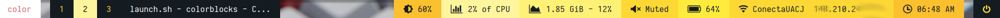

# COLORBLOCS

este es un tema personalizado para polybar para i3, con algunas configuraciones propias

## Instalacion

antes de instalar asegurese de tener instalado polybar, e i3

    git clone https://github.com/elisaac/colorblocs
    sudo mv ./colorblocs /usr/local/etc/polybar
    cd ~/.config/i3
    echo "exec_always --no-startup-id /usr/local/etc/polybar/colorblocks/launch.sh" | tee -a config

## Screenshoots

peuqenio ejemplo de como se ve el tema instalado

**Workspaces**
- 

**Modules** 
- 
