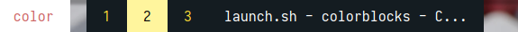

# Polybar Colorblocks Theme for Manjaro i3

**Index:**
- [Español](#instalación-de-polybar-colorblocks-para-manjaro-i3)
- [English](#polybar-colorblocks-installation)

## Instalación del tema Colorblocks en Polybar para Manjaro i3

Este script de instalación simplifica el proceso de configuración de Polybar utilizando el tema Colorblocks en el entorno Manjaro i3. Sigue los pasos a continuación para instalar y configurar Polybar con el tema Colorblocks en tu sistema.

### Requisitos previos
- [Polybar](https://github.com/polybar/polybar): Asegúrate de tener Polybar instalado en tu sistema antes de ejecutar este script.
- [Rofi](https://github.com/davatorium/rofi): Necesitarás tener Rofi instalado en tu sistema. Este script utiliza Rofi para ciertas funciones.

### Instrucciones de instalación

1. **Descargar el script:**

    ```bash
    wget https://raw.githubusercontent.com/elisaac/colorblocks/main/install.sh
    ```

2. **Dar permisos de ejecución:**

    ```bash
    chmod +x install.sh
    ```

3. **Ejecutar el script con permisos de administrador:**

    ```bash
    sudo ./install.sh
    ```

    Este paso es crucial ya que el script realiza operaciones que requieren permisos de administrador.

4. **Reiniciar i3:**

    Después de ejecutar el script, espera unos segundos para que las configuraciones surtan efecto y reinicia i3.

    ```bash
    i3-msg restart
    ```

5. **¡Listo!**

    Polybar con el tema Colorblocks debería estar ahora configurado en tu Manjaro i3.

### Nota

- Este script asume que estás utilizando el gestor de ventanas i3. Si estás utilizando otro gestor de ventanas, ajusta la configuración según sea necesario.

Esperamos que disfrutes utilizando Polybar con el tema Colorblocks. Si encuentras algún problema durante la instalación, revisa los mensajes de error que pueda mostrar el script y asegúrate de haber cumplido con los requisitos previos.

### Capturas de pantalla

Pequeño ejemplo de cómo se ve el tema instalado:

**Workspaces**



**Módulos** 


## Polybar Colorblocks Installation

This installation script simplifies the process of configuring Polybar using the Colorblocks theme in the Manjaro i3 environment. Follow the steps below to install and configure Polybar with the Colorblocks theme on your system.

### Prerequisites
- [Polybar](https://github.com/polybar/polybar): Ensure that Polybar is installed on your system before running this script.
- [Rofi](https://github.com/davatorium/rofi): You'll need to have Rofi installed on your system. This script uses Rofi for certain functions.

### Installation Instructions

1. **Download the script:**

    ```bash
    wget https://raw.githubusercontent.com/elisaac/colorblocks/main/install.sh
    ```

2. **Give execution permissions:**

    ```bash
    chmod +x install.sh
    ```

3. **Run the script with administrator permissions:**

    ```bash
    sudo ./install.sh
    ```

    This step is crucial as the script performs operations that require administrator permissions.

4. **Restart i3:**

    After running the script, wait a few seconds for the configurations to take effect and restart i3.

    ```bash
    i3-msg restart
    ```

5. **Done!**

    Polybar with the Colorblocks theme should now be configured on your Manjaro i3.

### Note

- This script assumes that you are using the i3 window manager. If you are using another window manager, adjust the configuration as needed.

We hope you enjoy using Polybar with the Colorblocks theme. If you encounter any issues during the installation, review the error messages that the script may display and ensure you have met the prerequisites.

### Screenshots

A small example of how the installed theme looks:

**Workspaces**


**Modules**


